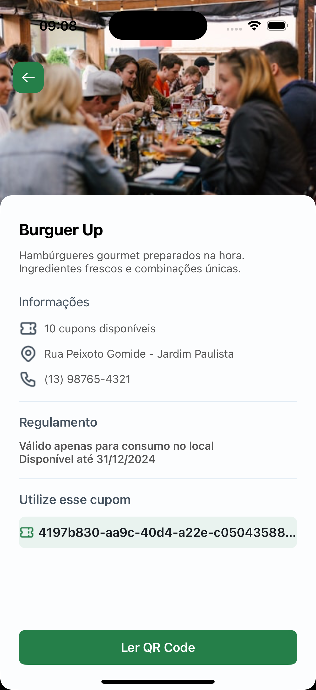

# Nearby NLW

O projeto é um aplicativo mobile de clube de benefícios com cupons para utilizar em estabelecimentos próximos a você.

Esse é um projeto do evento NLW Pocket Mobile, um dos conteúdos disponíveis para alunos da Rocketseat

<h2>Splash</h2>

<h2>Boarding</h2>

<h2>Início</h2>

<h2>Início expandida</h2>

<h2>Detalhes</h2>

## Protótipo

[Figma](https://www.figma.com/design/2Q5ZbA3Bt8FxxED8Kl5abP/NLW-Pocket-Mobile-•-Nearby-(Community)?node-id=0-1&p=f&t=KZ0FvtHHplSQNInj-0)